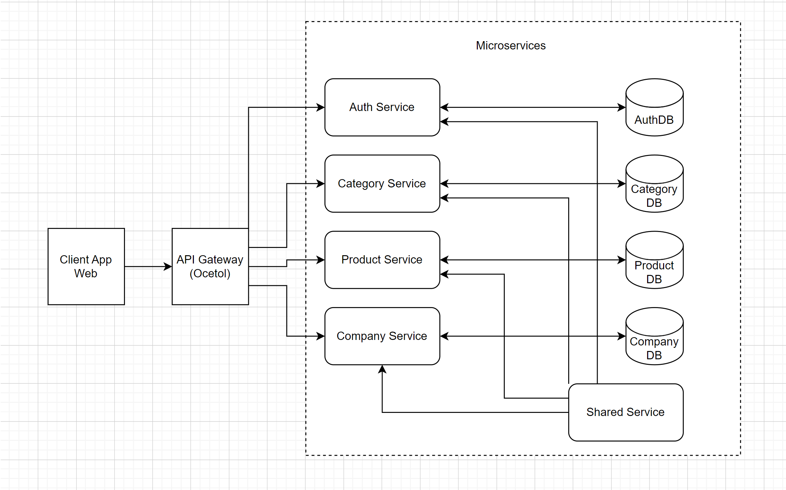
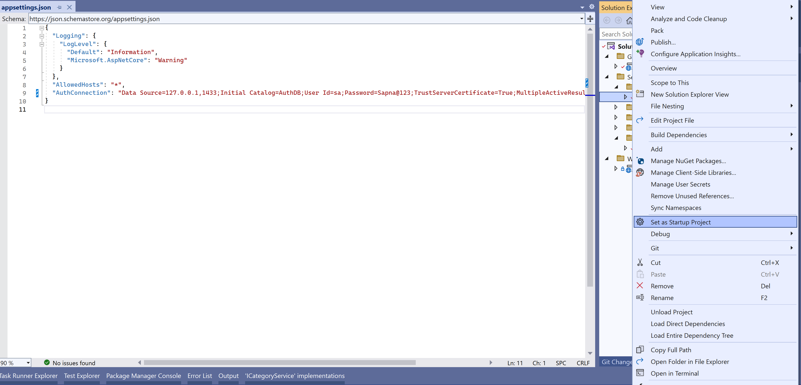
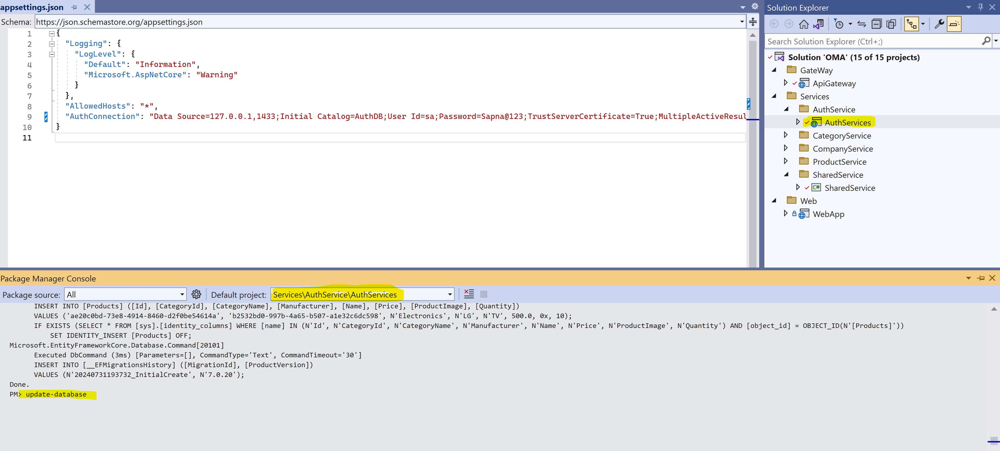
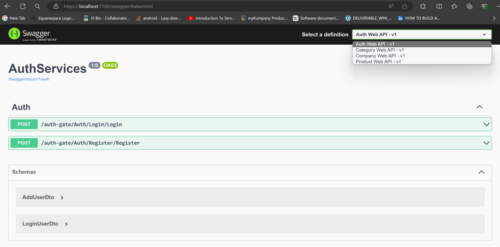

## **Project Overview**

This project is structured to develop a set of microservices using **.NET Core 7.0** for a **Category, Product, and Company management system**. The architecture includes an **API Gateway** for routing and security, and a **user interface using ASP.NET Core**. Each microservice will implement **CRUD operations**, **JWT tokenization** for authentication and authorization, use **ORM** for database communication, and follow specific design patterns.

### **Components**

- **Gateway**
  - **ApiGateway**: Handles routing and security.

- **Services**
  - **AuthService**: Manages authentication and authorization.
  - **CategoryService**: Manages categories with CRUD operations.
  - **CompanyService**: Manages companies with CRUD operations.
  - **ProductService**: Manages products with CRUD operations.
  - **SharedService**: Provides shared functionalities across services.

- **Web**
  - **WebApp**: The user interface for interacting with the microservices.

## **MicroService: Category**

### **Features**

1. **CRUD Operations**: Create, Read, Update, Delete categories.
2. **Models**: GUID, Category Name, Orders.
3. **Authorization and Authentication**: JWT Tokenization.
4. **Database Communication**: ORM and stored procedures.
5. **Design Pattern**: Factory Pattern.
6. **Category Types**: Electronics, Home Appliances, Clothes, etc.
7. **Swagger UI**: Disabled to ensure security without Gateway Routing.
8. **Exception Handling**: Implemented.

## **MicroService: Product**

### **Features**

1. **CRUD Operations**: Create, Read, Update, Delete products.
2. **Models**: GUID, Product Name, Product Category Name, Manufacturer, Quantity, Price, Product Images (JPEG only).
3. **Authorization and Authentication**: JWT Tokenization.
4. **Database Communication**: ORM and stored procedures.
5. **Design Pattern**: CQRS (Command Query Responsibility Segregation).
6. **Product Types**: Electronics, Home Appliances, Clothes, etc.
7. **Swagger UI**: Disabled to ensure security without Gateway Routing.
8. **Exception Handling**: Implemented.

### **Features**

1. **CRUD Operations**: Create, Read, Update, Delete products.
2. **Models**: GUID, Product Name, Product Category Name, Manufacturer, Quantity, Price, Product Images (JPEG only).
3. **Authorization and Authentication**: JWT Tokenization.
4. **Database Communication**: ORM and stored procedures.
5. **Design Pattern**: CQRS (Command Query Responsibility Segregation).
6. **Product Types**: Electronics, Home Appliances, Clothes, etc.
7. **Swagger UI**: Disabled to ensure security without Gateway Routing.
8. **Exception Handling**: Implemented.

## **MicroService: Company**

### **Features**

1. **CRUD Operations**: Create, Read, Update, Delete companies.
2. **Models**: ID, Name, Street Address, City, State, Postal Address, Zip, Contact Number.
3. **Authorization and Authentication**: JWT Tokenization.
4. **Database Communication**: ORM and stored procedures.
5. **Design Pattern**: Factory Pattern.
6. **Company Types**: Examples include Samsung, Sony, Apple (for mobile phones).
7. **Swagger UI**: Disabled to ensure security without Gateway Routing.
8. **Exception Handling**: Implemented.

## **API Gateway**

### **Features**

1. **Routing**: Routes requests to the appropriate microservices.
2. **Security**: Handles authentication and authorization.

## **User Interface**

### **Features**

1. **ASP.NET Core**: User interface for each API.
2. **Notifications**: Uses SweetAlert for displaying success, failure, or CRUD operation notifications.

## **Setup Instructions**

### **Prerequisites**

- **.NET Core 7.0 SDK**
- **Docker** (for containerization)
- **MsSQL** or any other preferred database

### **Project System Design **


### **How Run Project **
For run this project we need some service , there is SQL Server 


Install MSSQL on Docker:

docker run -e "ACCEPT_EULA=Y" -e "MSSQL_SA_PASSWORD=Sapna@1234" -e "MSSQL_PID=Express" -p 1433:1433 -d mcr.microsoft.com/mssql/server:2019-latest

If you already have SQL server on your PC, then you need to update your connection string in each microservice project.


Once you update the DB connection string in the appsettings.json for each project, you have to run the DB migration script to run your application.


Set AuthService as the startup project and then open the package manager console window. Run the Update-Database command:




Run the database migration script for the following services:

- CategoryService.Api
- CompanyService.Api
- ProductService.Api

You will then be able to see all databases in your MSSQL server:


Now, start all projects:

It's better to run all projects together. Right-click on the solution file, select properties, and then select multiple startup projects. Start all services except SharedServices project which is a class library.


When you start the project, all microservices will run on different ports and you can see all projects:




### **Installation**

1. **Clone the Repository**
   ```sh
   git clone https://github.com/sapna-gupta123/Microservices.git
   cd project

